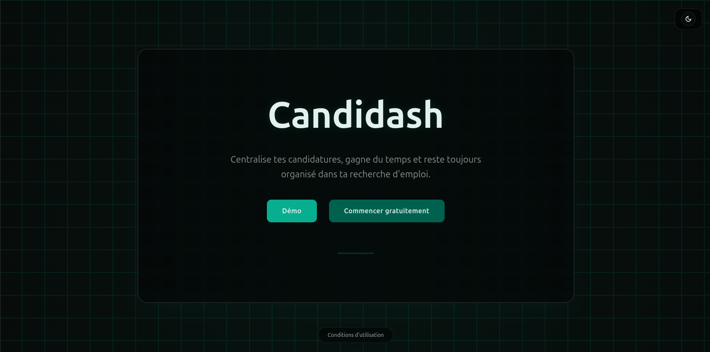
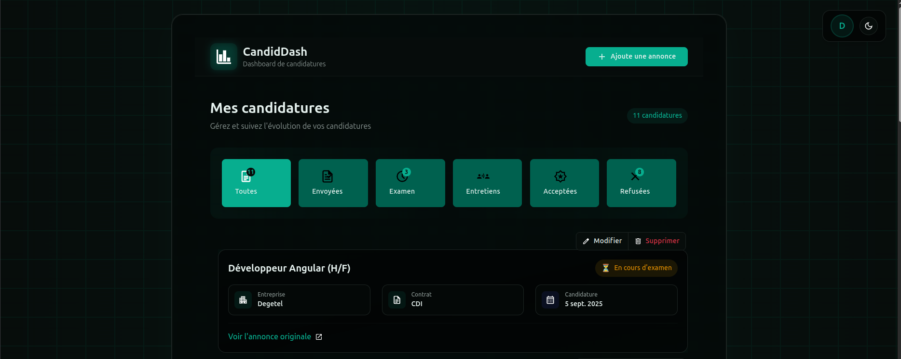

# CandiDash (Frontend Angular 20)

Une application Angular moderne pour suivre ses candidatures (jobs) et piloter un tableau de bord personnel. Ce dépôt contient le frontend. Le backend NestJS associé se trouve ici :

https://github.com/djoudj-dev/nest-candidash-app.git

Ci‑dessous vous trouverez une présentation, des captures, l’architecture et les instructions pour démarrer en local (frontend + backend) ainsi que des notes de build/Docker.

---

## Aperçu

- Suivi de candidatures (création, édition, statut, notes)
- Authentification et pages d’auth (reset password, etc.)
- Thème clair/sombre et UI réactive (signals Angular)
- Architecture standalone (Angular 20+), ChangeDetection OnPush
- Tests unitaires avec Vitest

### Captures d’écran





> Astuce: sur GitHub, les images ci‑dessus s’affichent si le dossier `public/images` est committé avec `img1.png` et `img2.png`.

---

## Pile technique

- Angular 20 (signals, nouveau contrôle de flux @if/@for)
- Routing Angular
- Tailwind CSS 4 (PostCSS)
- Build via Angular CLI (avec plugin Vite présent dans les devDependencies pour optimisation locale)
- Docker + Nginx pour l’image de prod

---

## Structure (extraits)

- src/app/core: services transverses, interceptors, utils
- src/app/features: fonctionnalités (auth, dashboard, jobs, …)
- src/app/shared: composants UI réutilisables (ex: theme-toggle)
- src/environments/environment.ts: configuration de l’API (apiUrl)
- public/images: assets statiques dont les captures

---

## Prérequis

- Node.js 20+
- pnpm (recommandé) ou npm
- Un backend NestJS opérationnel (voir plus bas)

---

## Lancer le backend (NestJS)

Dépôt/chemin local: /home/djoudj/WebstormProjects/nest-candidash-app

Étapes typiques (à exécuter depuis le dossier du backend):

```bash
pnpm install
pnpm start:dev
```

Par défaut, l’API écoute sur http://localhost:3000 (adaptez selon votre projet). Assurez‑vous qu’elle expose les routes attendues par le frontend (ex: /api/v1/auth, /api/v1/jobs, …).

---

## Configuration du frontend

Le frontend lit l’URL de l’API dans `src/environments/environment.ts`.

Exemple actuel:

```ts
export const environment = {
  production: true,
  apiUrl: 'https://api-candidash.djoudj.dev/api/v1',
};
```

En local, si votre backend tourne sur http://localhost:3000, vous pouvez temporairement pointer vers cette URL (ou utiliser la variable de build Docker `API_URL`, voir plus bas):

```ts
export const environment = {
  production: false,
  apiUrl: 'http://localhost:3000',
};
```

> Conseil: ne commitez pas de secrets; préférez des variables d’environnement/CI pour les URLs sensibles en production.

---

## Démarrer le frontend en local

Installation des dépendances:

```bash
pnpm install
```

Lancer le serveur de dev (Angular CLI):

```bash
pnpm start
# ou
ng serve
```

Par défaut sur http://localhost:4200

> Astuce: le projet inclut Vitest; vous pouvez lancer les tests en watch.

---

## Scripts utiles

- Dev: `pnpm start` (Angular CLI)
- Build prod: `pnpm build`
- Build watch: `pnpm watch`
- Tests unitaires: `pnpm test` (Vitest) ou `pnpm test:watch`

> Lint/format: ESLint + Prettier sont configurés. Vous pouvez exécuter ESLint manuellement: `npx eslint .` (ou ajoutez des scripts selon vos préférences).

---

## Docker (prod)

Une image multi‑étapes est fournie avec Nginx. Elle permet de fixer l’URL d’API au build via `API_URL`.

Build de l’image avec une API locale:

```bash
docker build -t candidash-frontend --build-arg API_URL=http://localhost:3000 .
```

Run du conteneur:

```bash
docker run --rm -p 8080:80 candidash-frontend
```

Le site sera disponible sur http://localhost:8080

---

> Les tests s’exécutent dans JSDOM. Ajoutez vos fichiers `*.spec.ts` proche du code testé.

---

## Bonnes pratiques (rappel)

- Composants standalone, ChangeDetection OnPush
- Signals pour l’état local; `@if` / `@for` dans les templates (avec `track` pour @for)
- Services globaux fournis en root; DI via `inject()` côté services
- UI: privilégier `[class.xxx]` / `[style.xxx]` pour des bindings simples

---

## Roadmap (exemples)

- Filtrage/tri avancés des candidatures
- Notifications/toasts cohérents côté UI
- Internationalisation (i18n)

---

## Licence

MIT (ou celle de votre organisation).
