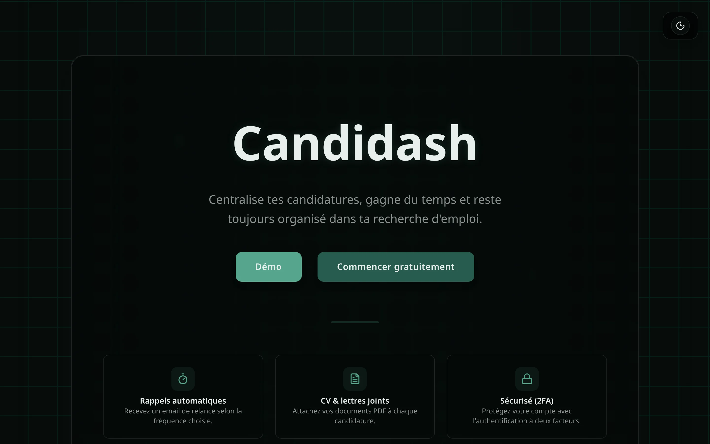
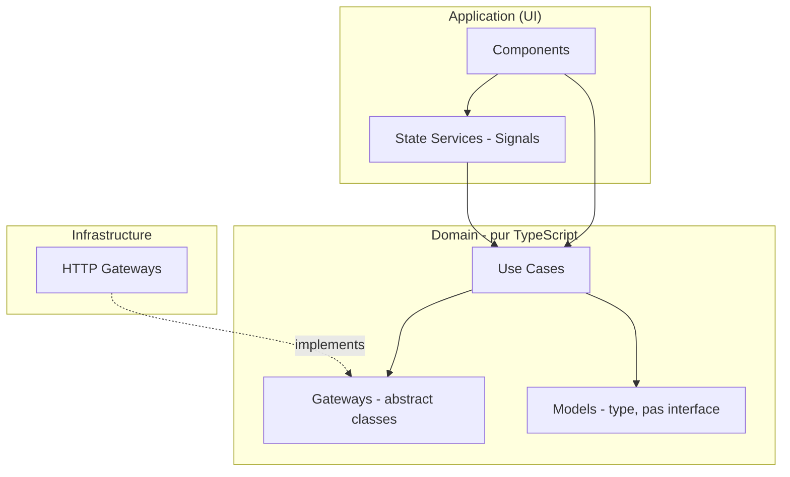
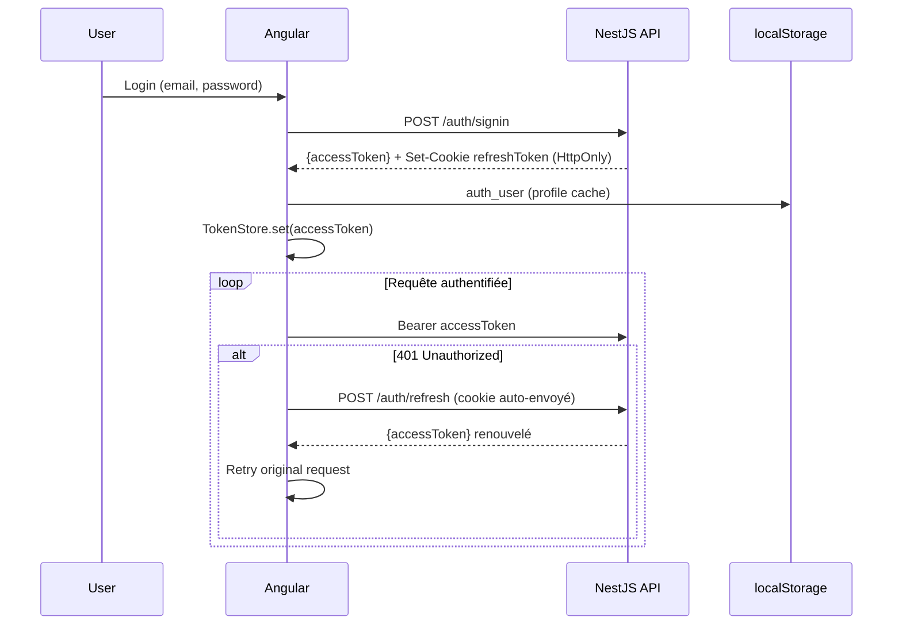
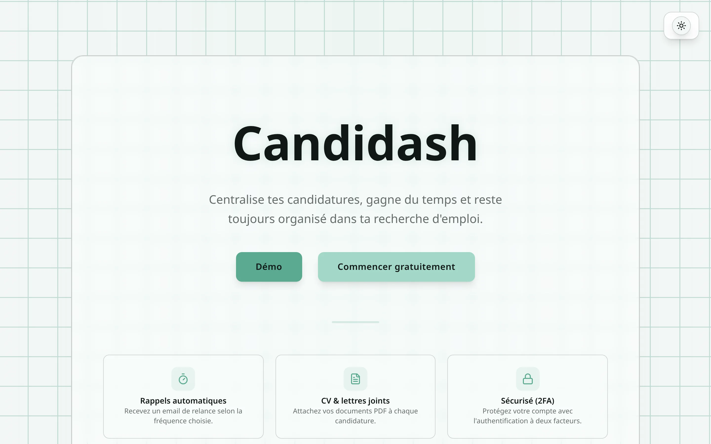
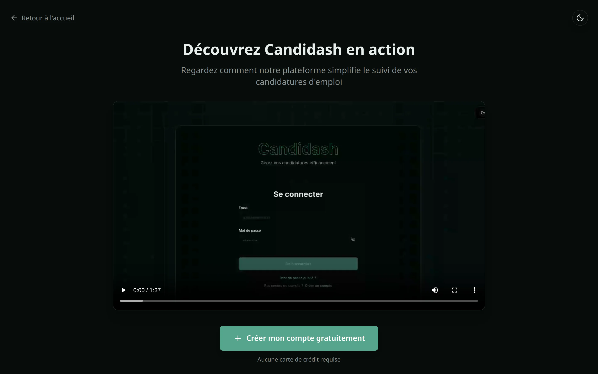
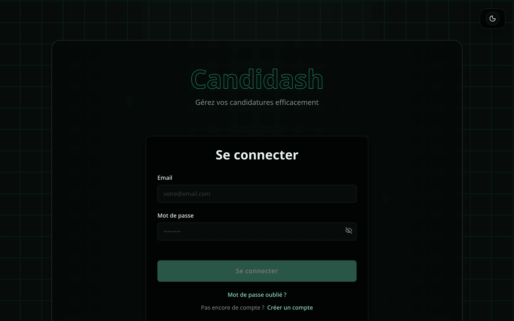
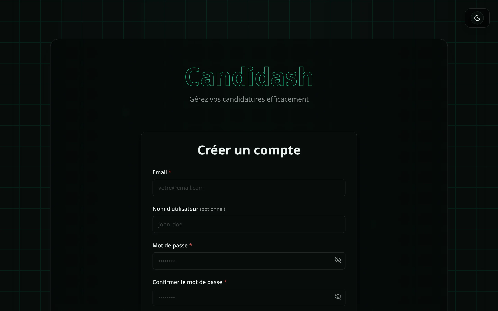

<div align="center">

# 📊 Candidash — Frontend

### Tableau de bord personnel pour **piloter sa recherche d'emploi**

**Angular 21 · Signals · Clean Architecture · Rappels automatisés**

[](https://angular.dev)
[](https://www.typescriptlang.org)
[](https://tailwindcss.com)
[](https://vitest.dev)
[]()

[**🔗 Démo live**](https://candidash.j-ned.dev) · [**📸 Captures**](#-captures-décran) · [**🏗️ Architecture**](#️-clean-architecture--3-couches) · [**📡 Backend NestJS**](https://github.com/djoudj-dev/nest-candidash-app)



</div>

---

## 📖 Sommaire

- [🎯 Le problème](#-le-problème)
- [💡 La réponse](#-la-réponse)
- [✨ Fonctionnalités](#-fonctionnalités)
- [🏗️ Clean Architecture — 3 couches](#️-clean-architecture--3-couches)
- [🔐 Authentification côté client](#-authentification-côté-client)
- [🧰 Stack technique](#-stack-technique)
- [📸 Captures d'écran](#-captures-décran)
- [🚀 Installation](#-installation)
- [🗺️ Roadmap](#️-roadmap)

---

## 🎯 Le problème

Une recherche d'emploi active, c'est **50 à 100 candidatures** à suivre en parallèle :

- Quel statut pour chaque annonce ? (envoyée, relance, entretien, refus, acceptation)
- À quel moment relancer sans devenir insistant ?
- Où est passé le CV envoyé pour *ce* poste ? La lettre personnalisée ?
- Quel est mon taux de réponse réel ? Sur quels canaux ?

Les tableurs Excel **ne scalent pas**. Les CRM SaaS sont **surdimensionnés** et confient vos données de recherche d'emploi à un tiers. Les extensions LinkedIn ne gèrent que LinkedIn.

## 💡 La réponse

**Candidash** = un tracker dédié, focalisé sur ce qu'un candidat a vraiment besoin :

1. **Centraliser** les candidatures dans un tableau de bord unique
2. **Analyser** les retours (taux de réponse, statuts, efficacité)
3. **Être rappelé** automatiquement pour relancer sans oublier
4. **Joindre CV + LM** par candidature (stockage S3)
5. **Protéger** le compte avec 2FA TOTP

**Self-hosted, open-source, zéro tracker tiers.**

---

## ✨ Fonctionnalités

### 🎯 Suivi candidatures

| Feature | Détails |
|---------|---------|
| **Dashboard KPIs** | Nombre total, taux de réponse, entretiens, répartition par statut |
| **Suivi par statut** | `APPLIED` · `INTERVIEW` · `REJECTED` · `ACCEPTED` |
| **Types de contrat** | CDI · CDD · Intérim · Stage · Alternance · Freelance |
| **Notes & historique** | Journal libre par candidature (entretiens, échanges, tests techniques) |
| **CV & lettres joints** | Upload PDF par candidature, stockage S3 côté backend |
| **Lien offre original** | URL de l'annonce sauvegardée |

### ⏰ Rappels automatiques

| Feature | Détails |
|---------|---------|
| **Fréquence personnalisée** | J+3, J+7, J+14… par candidature |
| **Envoi horaire** | CRON backend scanne les relances dues toutes les heures |
| **Email HTML** | Template personnalisé avec lien direct vers la candidature |
| **Désactivation ciblée** | Stop rappels par candidature sans la supprimer |

### 🔐 Compte & sécurité

| Feature | Détails |
|---------|---------|
| **Signup + email verification** | Code envoyé par email avant activation du compte |
| **2FA TOTP** | Google Authenticator, Authy… + codes de récupération |
| **Reset password** | Flow complet (demande → email → nouveau mot de passe) |
| **Refresh token rotation** | HttpOnly cookie, invalidé au logout |
| **Delete account** | Suppression cascade des candidatures et relances |

### 🎨 UX transversale

- 🌙 **Thème clair/sombre** — switch runtime persistant
- 📱 **Responsive** — mobile-first, Tailwind v4 avec `@theme`
- 🔔 **Toasts** — feedback système pour toutes les actions
- ⚡ **Zone-free** — Angular signals + `provideZoneChangeDetection` avec `eventCoalescing`
- 🔗 **Runtime config** — API URL depuis `/config.json`, pas de `environment.ts` figé

---

## 🏗️ Clean Architecture — 3 couches

Chaque feature est structurée **`domain → infra → application`** avec une règle de dépendance stricte : **le domain ne connaît rien d'Angular**.


```mermaid
graph TD
  subgraph "Application (UI)"
    C[Components]
    ST[State Services - Signals]
  end

  subgraph "Domain - pur TypeScript"
    UC[Use Cases]
    GW[Gateways - abstract classes]
    MD[Models - type, pas interface]
  end

  subgraph "Infrastructure"
    HTTP[HTTP Gateways]
  end

  C --> ST
  ST --> UC
  C --> UC
  UC --> GW
  HTTP -.implements.-> GW
  UC --> MD
```

### Structure par feature

```
src/app/features/<feature>/
├── domain/                          # Zéro dépendance Angular
│   ├── models/*.model.ts            # Types (User, JobTrack, Reminder…)
│   ├── gateways/*.gateway.ts        # Abstract class (contrat)
│   └── use-cases/*.use-case.ts      # 1 use case = 1 execute()
├── infra/
│   └── http-*.gateway.ts            # Implémentation HttpClient
└── application/
    ├── *-state.ts                   # Signal state + orchestration
    └── components/                  # Dumb UI
```

### Features implémentées

| Feature | Use cases | Gateway |
|---------|-----------|---------|
| **auth** | signin, signup, signout, verify-registration, resend-verification, forgot-password, reset-password, refresh-token, auto-login, setup-totp, verify-totp-setup, validate-totp, disable-totp, use-recovery-code | `AuthGateway` |
| **jobtrack** | list, get, create, update, delete | `JobtrackGateway` |
| **profile** | get-profile, update-profile, change-password, delete-account | `ProfileGateway` |

### Bénéfice concret — switch d'implémentation

Basculer `Http*` → `InMemory*` pour les tests/dev : **une seule ligne** dans `app.config.ts` :

```typescript
providers: [
  { provide: AuthGateway, useClass: HttpAuthGateway },
  { provide: JobtrackGateway, useClass: HttpJobtrackGateway },
  { provide: ProfileGateway, useClass: HttpProfileGateway },
]
```

### State management — signals, zéro NgRx

- `AuthState`, `ProfileState` : `signal<State>` privé + `computed()` publics
- Les side effects (toasts, navigation, localStorage) sont dans les state services — pas dans les composants
- Les composants injectent **les use cases** (via DI), pas les gateways directement

---

## 🔐 Authentification côté client


```mermaid
sequenceDiagram
  participant U as User
  participant App as Angular
  participant API as NestJS API
  participant LS as localStorage

  U->>App: Login (email, password)
  App->>API: POST /auth/signin
  API-->>App: {accessToken} + Set-Cookie refreshToken (HttpOnly)
  App->>LS: auth_user (profile cache)
  App->>App: TokenStore.set(accessToken)

  loop Requête authentifiée
    App->>API: Bearer accessToken
    alt 401 Unauthorized
      App->>API: POST /auth/refresh (cookie auto-envoyé)
      API-->>App: {accessToken} renouvelé
      App->>App: Retry original request
    end
  end
```

### Points-clés

- **Access token** en mémoire (`TokenStore` = signal) — ni localStorage, ni cookie lisible JS
- **Refresh token** = cookie HttpOnly (inaccessible au JS, protégé XSS)
- **Interceptor** `authInterceptor` auto-attache le Bearer + retry sur 401
- **Guards** : `authGuard`, `guestGuard`, `authMatchGuard` — fonctionnels Angular 15+
- **Runtime config** via `provideAppInitializer()` charge `/config.json` — zéro rebuild pour changer d'URL API

---

## 🧰 Stack technique

### Frontend

- **Angular 21** — standalone components, Signals, `inject()` partout
- **TailwindCSS v4** — thème custom via `@theme` dans `styles.css` (PostCSS plugin)
- **PostCSS** + `@tailwindcss/postcss`
- **RxJS 7.8** — combiné avec signals via `toSignal()` / `toObservable()`

### Tests

- **Vitest 4** + `@analogjs/vite-plugin-angular`
- **jsdom** pour le DOM headless
- **@testing-library/angular** pour les composants
- Pattern Given/When/Then (AAA)

### DX

- **ESLint 9** + `@angular-eslint` + Prettier 3 (100 cols, single quote, angular parser HTML)
- Règles strictes : `prefer-readonly`, `prefer-nullish-coalescing`, `prefer-optional-chain`
- Templates : max 3 conditional complexity, 5 cyclomatic complexity
- **Path aliases** : `@app/*`, `@core/*`, `@features/*`, `@shared/*`

### Conventions de nommage (Angular 2025)

| Élément | Pattern | Exemple |
|---------|---------|---------|
| Composants | Pas de suffixe `Component` | `Button`, `Layout`, `Home` |
| State services | Pas de suffixe `Service` | `AuthState`, `Toaster`, `ThemeManager` |
| Use cases | Suffixe `UseCase` conservé | `SigninUseCase` |
| Gateways | Suffixe `Gateway` conservé | `AuthGateway`, `HttpAuthGateway` |
| Modèles domain | `*.model.ts` avec `type` (pas `interface`) | `auth.model.ts` |

---

## 📸 Captures d'écran

<table>
  <tr>
    <td width="50%">
      <p align="center"><b>Home — Dark mode</b></p>
      
    </td>
    <td width="50%">
      <p align="center"><b>Home — Light mode</b></p>
      
    </td>
  </tr>
  <tr>
    <td width="50%">
      <p align="center"><b>Features — Démo vidéo</b></p>
      
    </td>
    <td width="50%">
      <p align="center"><b>Connexion</b></p>
      
    </td>
  </tr>
  <tr>
    <td colspan="2">
      <p align="center"><b>Inscription</b></p>
      
    </td>
  </tr>
</table>

---

## 🚀 Installation

> Pré-requis : Node.js ≥ 20, pnpm, backend NestJS en local ([nest-candidash-app](https://github.com/djoudj-dev/nest-candidash-app))

```bash
# 1. Cloner
git clone https://github.com/djoudj-dev/ng-candidash-app.git
cd ng-candidash-app

# 2. Installer
pnpm install

# 3. Configurer l'URL de l'API
# → public/config.json (chargé au runtime, pas figé au build)
echo '{"apiUrl":"http://localhost:3000/api/v1"}' > public/config.json

# 4. Dev server
pnpm start
# → http://localhost:4200

# 5. Tests
pnpm test              # Vitest run once
pnpm test:watch        # Watch mode
npx vitest src/...     # Un fichier spécifique
```

### Build production

```bash
pnpm build
# → dist/ng-candidash-app/browser/
```

### Docker

```bash
# Build avec URL API injectée au runtime via config.json
docker build -t candidash-frontend --build-arg API_URL=https://api.candidash.j-ned.dev .

# Run
docker run --rm -p 8080:80 candidash-frontend
# → http://localhost:8080
```

---

## 🗺️ Roadmap

- [x] Clean Architecture 3 couches par feature
- [x] Auth complète (signup + email verify + signin + 2FA + refresh rotation + reset password)
- [x] CRUD candidatures avec statuts et types de contrat
- [x] Upload CV/LM par candidature
- [x] Rappels automatiques (fréquence configurable)
- [x] 2FA TOTP (setup, validation, codes de récupération)
- [x] Thème clair/sombre runtime
- [x] Runtime config (pas de `environment.ts`)
- [ ] Statistiques avancées — taux de réponse par canal
- [ ] Export CSV / PDF des candidatures
- [ ] Import offres LinkedIn (extension navigateur)
- [ ] Kanban drag & drop entre statuts
- [ ] PWA offline-first

---

## 🔗 Écosystème Candidash

- **Frontend (ce dépôt)** — Angular 21
- **Backend** — [nest-candidash-app](https://github.com/djoudj-dev/nest-candidash-app) · NestJS 11 + Prisma 7 + PostgreSQL

---

<div align="center">

**Développé par [Julien Nédellec](https://j-ned.dev)**

[](https://j-ned.dev)
[](https://github.com/djoudj-dev)

</div>
